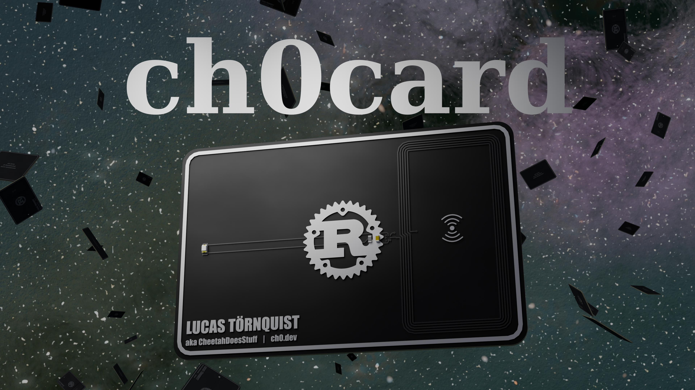
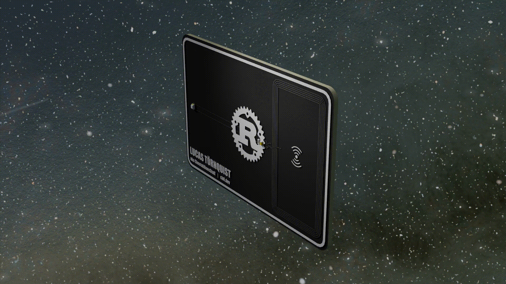
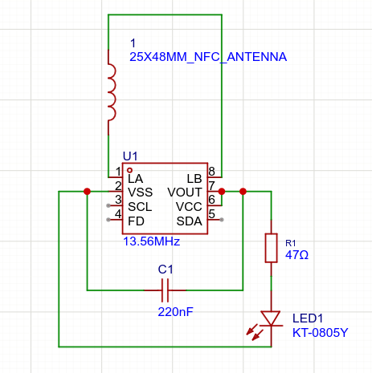
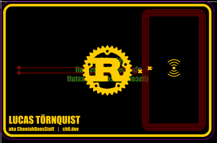
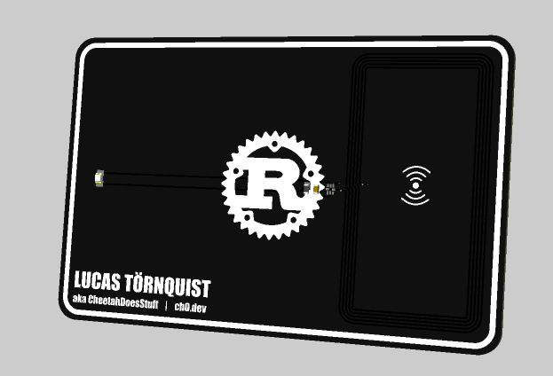
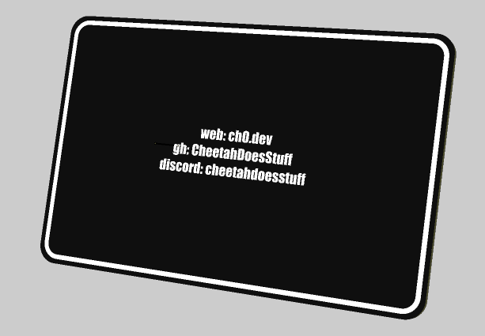

<h1 align="center">
ch0card <br>
 <br>
</h1>
<h4 align="center">
    A business card with built in NFC
</h4>

<div align="center">


</div>
<p align="center">
  <a href="#about">About</a> •
  <a href="#repo-structure">Structure</a> •
  <a href="#details">Details</a> •
  <a href="#images">Images</a> •
  <a href="#making-it-yourself">Making it yourself</a> •
  <a href="#links">Links</a>
</p>
<br>
<br>
<p align=center>


</p>

## About

**ch0card** is a minimalistic business card equipped with modern NFC technology to integrate modern online portfolios with classic physical business cards. (Specifically made for me)

## Repo structure
```
ch0card (root)
|- BOMs
|  |- parts_bom.csv - the parts BOM, containing the components
|  |- pcb_and_pcba_bom.csv - the price of the PCB itself and PCBA from JLCPCB, from the time of writing
|
|- Images
|  |- 3d-back.png - Back of the pcb (3d model)
|  |- 3d-front.png - Front of the pcb (3d model)
|  |- pcb.png - The PCB, in the EasyEda Pro editor
|  |- schem.png - The schematic, in the EasyEda Pro editor
|  |- ch0card4k.png - A 4k render of the card, in blender
|  |- spincard.gif - A gif of the card spinning (as seen above)
|  |- breakoutcard.gif - A gif of the card seperating into layers (as seen above)
|
|- PCB
|  |- ch0card-gerbers.zip - The PCB gerber files (used to order the pcb)
|  |- ch0card-model.step - The 3D model of the pcb and components, in STEP form
|
|- README.md - This!!
```

## Details
It is a really simple PCB, containing only 5 components:
- NFC Chip (NTAG I2C Plus)
- The antenna (Copper traces on the PCB, forming a "coil")
- The led (amber/orange colored)
- A resistor
- A capacitor

The main component is the NFC chip. The chip is connected to the antenna which catches the signals from phones and sends them to the NFC chip (and the other way around), and is basically an extension of the 2 pins on the NFC chip for the antenna.

The LED is then connected to the chip through a resistor and capacitor, using the chips "Power Harvest" feature, basically meaning that it, using the antenna, takes power wirelessly from the phone/device while its connected. This results in the LED  lighting up while the phone is connected, adding some user feedback, UX design wooo!

Then there is the decorations, which are just images/text/shapes on the PCBs silkscreen. The font for the text is called Impact and can be found [here](https://font.download/font/impact). The images used is the  as well as [this](https://uxwing.com/wireless-icon/) wireless/wifi icon.

### Images
<div align="center">
  <table>
    <tr>
      <td valign="bottom"></td>
      <td valign="bottom"></td>
  </table>
</div>
<div align="center">
  <table>
    <tr>
      <td valign="bottom"></td>
      <td valign="bottom"></td>
  </table>
</div>
<div align="center">
  <table>
    <tr>
      <td valign="bottom"></td>
      <td valign="bottom"></td>
      <td valign="bottom"></td>
  </table>
</div>  

## Making it yourself
To make something like this yourself, you can follow [this](https://jams.hackclub.com/jam/hacker-card) tutorial!  
When the PCB has arrived you can flash it using an app (Personally i use [NFC tools](https://play.google.com/store/apps/details?id=com.wakdev.wdnfc) which is availble for both android and iphone.  

Using your app of choice, flash the chip with this NFC command:  
`A2:03:E1:10:6D:00,A2:04:03:04:D8:00,A2:05:00:00:FE:00`  

Then you can write a url on it using the app! After that, people
can scan your card with their phone (assuming its on and nfc is enabled) and it will open the written website!

## Links
[EasyEda Pro project](https://oshwlab.com/cheetahdoespcb/project_jrpucpxz)  
[Pixl project](https://pixl.hackclub.com/explore/#project=293)  
[Github repo](https://github.com/CheetahDoesStuff/ch0card)  

### Do you think this is cool? Check out some of my other projects!
**Hardware**  
[USBuddy!](https://github.com/CheetahDoesStuff/USBuddy) - A small usb hub, for your keychain!  
[ExrPad v1](https://github.com/CheetahDoesStuff/ExrPad-v1) - A macropad with keys, a rotary encoder and a screen!  

**Software**  
[Raytracer](https://github.com/CheetahDoesStuff/Raytracer) - A CPU raytracer to render predefined scenes  
[Wrix](https://github.com/CheetahDoesStuff/wrix) - A simple chat room with HackClub auth  
[Kiln](https://github.com/CheetahDoesStuff/kiln) - A simple url shortener  
[Pesto](https://github.com/CheetahDoesStuff/pesto) - A pastebin clone  
[xv0](https://github.com/CheetahDoesStuff/xv0) - An operating system written in rust, from scract

Check out this and more on [my github](https://github.com/CheetahDoesStuff)!